# 环境搭建: 双系统: 基于Ubuntu/Linux 安装Windows或其他Linux发行版并实现开机双系统引导

## 背景

很多人有双系统的需求, 网上也有很多安装双系统的教程。但是大多数教程都是基于Windows上安装另外一个系统(如: Ubuntu)。而有部分同学(例如: 我自己)电脑上先安装的是Ubuntu之类的Linux发行版本, 想基于本身的Linux发行版本另外安装一个其它Linux发行版本或者Windows系统 实现开机双系统引导, 而网上的相关的文档相对就要少很多。所以本文就以Ubuntu为例, 简单记录/介绍下: 

- 1.如何在Ubuntu如何制作系统启动/安装盘
- 2.如何再先安装Ubuntu的电脑上, 安装双系统并通过GRUB完成开机双系统引导

## 0. 前置条件

- 一台已经安装Ubuntu的电脑
- 一个U盘

**注意:** 制作系统安装盘, U盘中的数据会被清除, 建议先备份U盘中重要数据或者使用全新的U盘。

### 1. 下载系统ISO镜像文件

### 1.1 kubuntu

- 下载地址: https://kubuntu.org/getkubuntu/

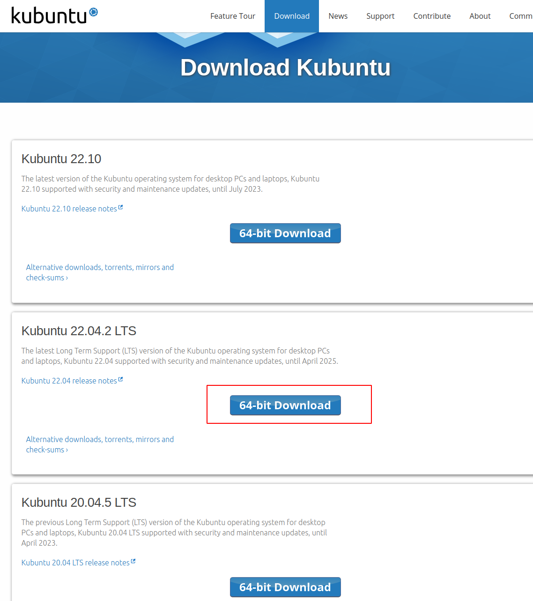

### 1.2 Windows

- 下载地址: https://www.microsoft.com/en-hk/software-download/windows11

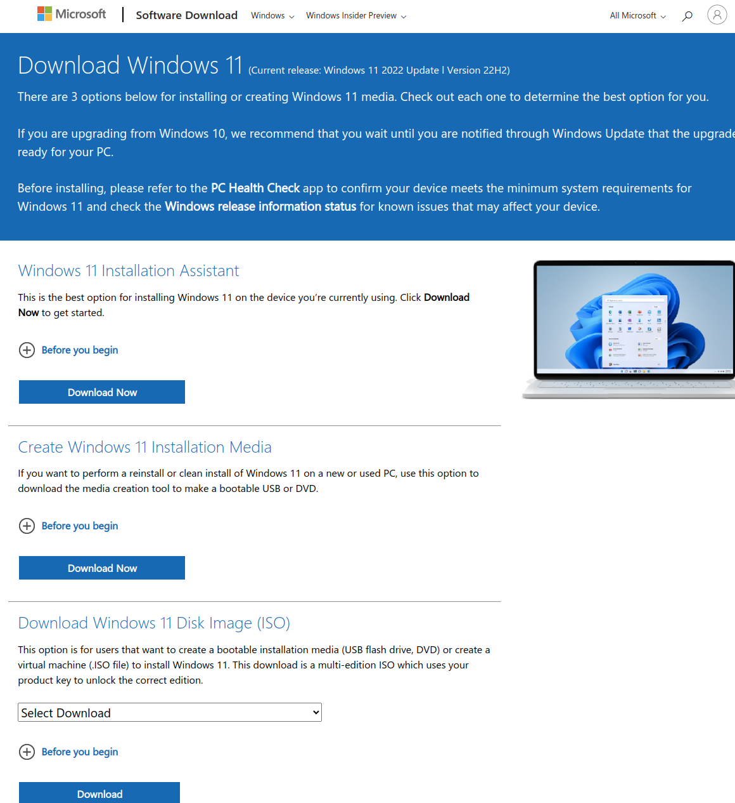

## 2.制作系统安装盘

> 使用开源软件Ventoy制作系统安装盘

### 2.1 Ventoy 下载 及 启动

- 下载地址: https://github.com/ventoy/Ventoy/releases

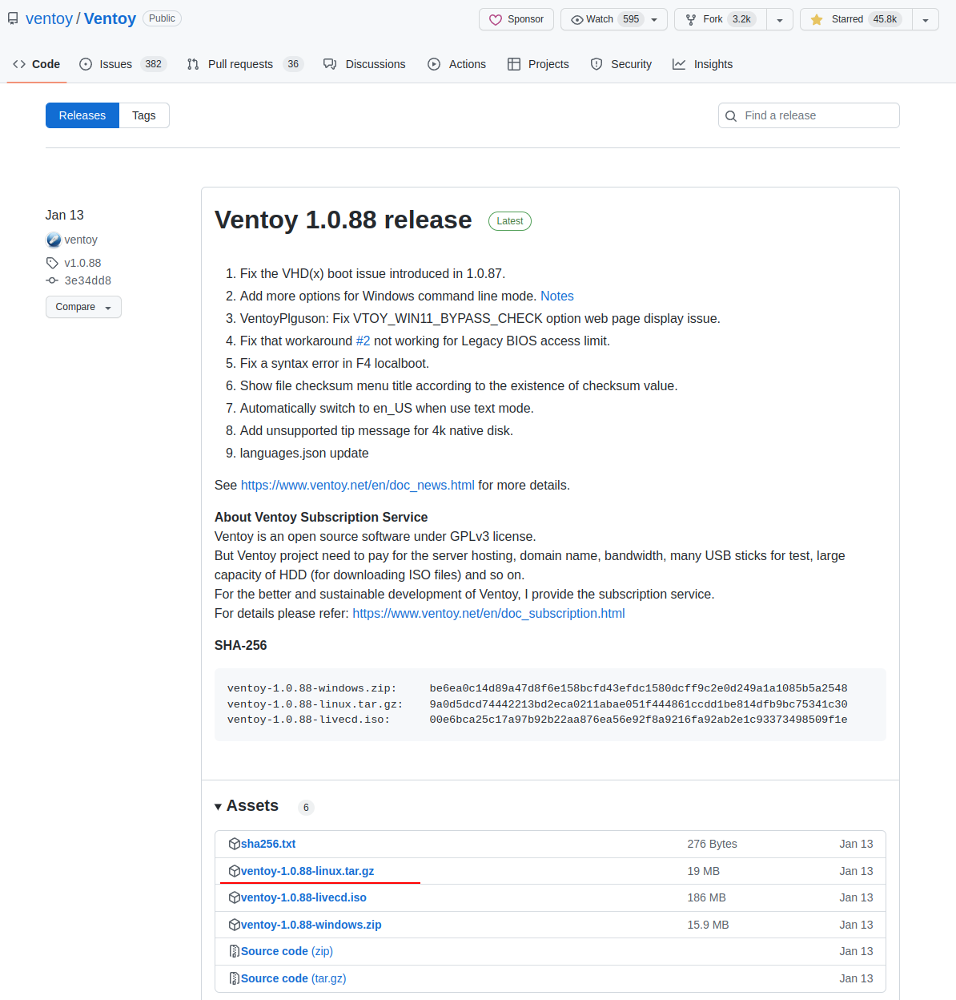

**解压并运行启动GUI界面**

> 根据平台选择对应程序执行
>
> 运行需要输入密码获取权限
>
> (这里我的电脑是Intel处理器所以选择x86_64)

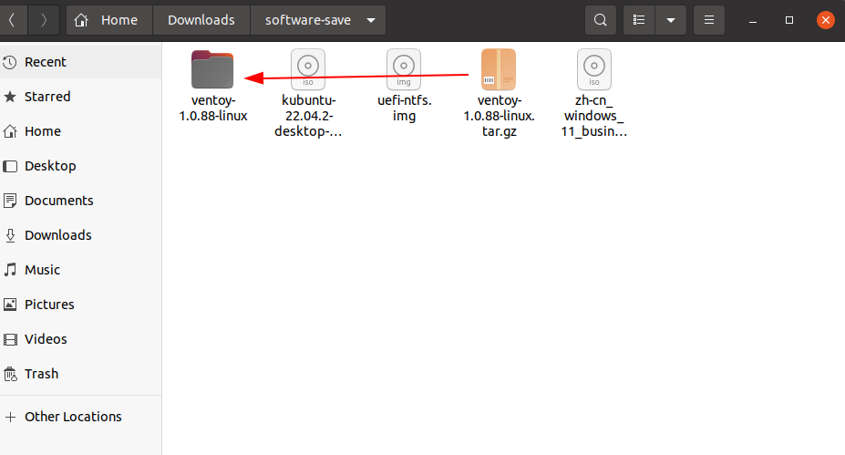

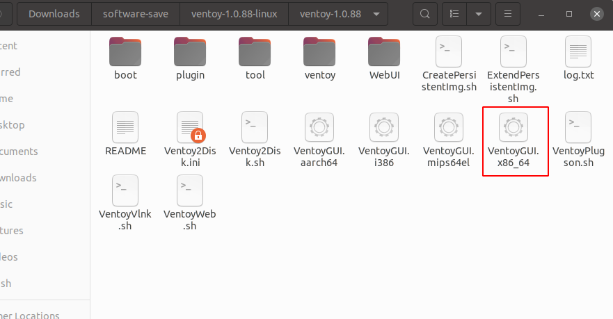

**运行后的界面**

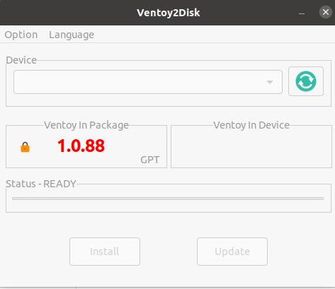

### 2.2 制作启动盘

> 1. 通过菜单栏(option->partition style->GPT) 选择GPT格式
> 2. 插入U盘&点击刷新按钮
> 3. 通过下拉菜单选择自己的U盘设备
> 4. 点击安装(Install)

### 2.3 复制系统镜像文件到安装盘

> 1.使用系统自带的磁盘工具(或mount命令)挂载U盘第一个分区: Ventoy(exFAT格式)分区 
>
> 2.复制下载好的iso系统镜像包到Ventoy分区

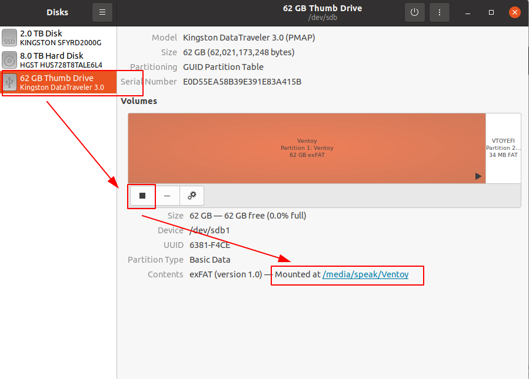

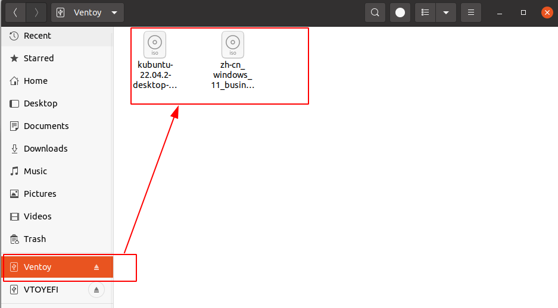

## 3.选择系统要安装的目标硬盘和分区

> 1.确定/划分系统安装的位置
>
> ​	1.1方法一: 基于有硬盘 划分出一块空闲区域(建议>100G)
>
> ​	1.2方法二: 直接安装到新的硬盘中

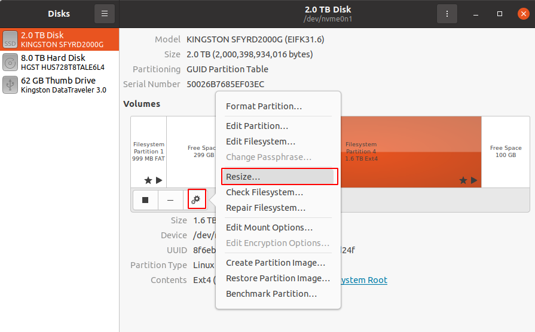

## 4.安装系统

> 重新启动电脑 进入BIOS, 并选择从U盘启动

### 4.1 BIOS U盘启动

> 1.进入BIOS关闭安全启动(如果需要)
>
> 2.从启动菜单中选择从U盘启动(这里选择U盘的第二个分区)
>
> 
>
> 注: 每个电脑在开机的时候进入BIOS的方式和界面可能存在不一样, 可以网上搜索下自己电脑进入BIOS的方式及配置方法(华硕主板一般是 F2 或 del键)

)

### 4.2 进入Ventoy 安装目标系统

> 这里选择以win系统为例子
>
> 1.在ventoy选择要安装的系统镜像
> 
> 2.选择正常安装
> 
> 3.选择自定义安装
>
> 4.选之前预留的空闲空间
>

)

)

)

)

## 5 设置GRUB开机双系统引导

### 5.1 关闭windows系统的快速启动

> 如果安装的是win系统, 可能导致开机无法进入BIOS和引导Linux系统
>
> 所以要先关闭window的快速启动功能

~~~
powercfg /h off
~~~

)

)

### 5.2 配置GRUB开机双系统引导

> 1.关机重启进入BIOS
>
> 2.设置Ubuntu启动优先级第一&从启动菜单选择Ubuntu分区进行启动
>
> 3.配置GRUB开机引导

)

~~~
os-prober # 检测可引导的系统

# 配置/添加 GRUB_DISABLE_OS_PROBER=false  系统检测
sudo vim /etc/default/grub

# 更新配置
sudo update-grub

# 重启
sudo reboot -f
~~~

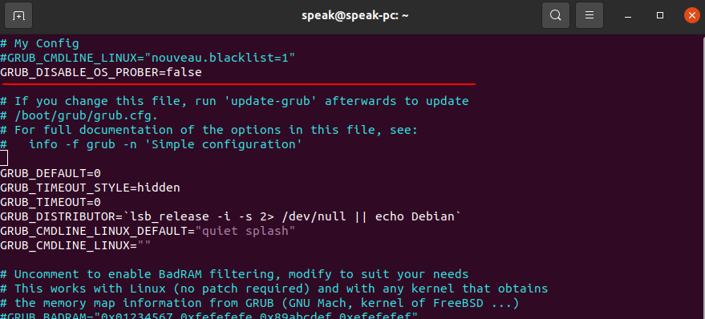

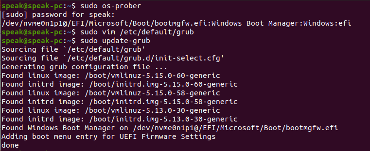

## 6 开机引导界面
>
> 每次开机的时候 可以进行选择要启动的系统
>

)

## 7.Other

[Ventoy Release](https://github.com/ventoy/Ventoy/releases)

[Ventoy 文档](https://www.ventoy.net/en/doc_start.html)

[create bootable in linux](https://itsfoss.com/bootable-windows-usb-linux/)

